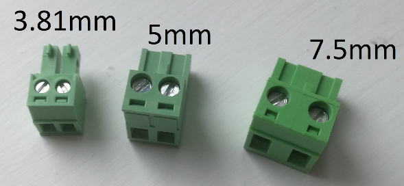

[CamCons](https://uk.farnell.com/-/ctb92he-2/-/dp/1717047) are the green connectors used for power wiring within our kit.

Our kit uses 3 different sizes of CamCon:

- 3.81mm: Used to power the [Pi](./pi.md)
- 5mm: Used to connect motors to the [Motor Board](./motor-board.md)
- 7.5mm: Used to power other boards off the [Power Board](./power-board.md)

CamCons are keyed such that they can only be inserted one way, and only the correct size will work.

Stripped wire should be inserted into the back of the CamCon, with as little bare wire exposed as possible. To secure the wire in place, tighten the corresponding screw.
!!! warning
    Take care in ensuring you connect the correct polarity to the board. Swapping the wires may not work as expected and can damage the boards.
