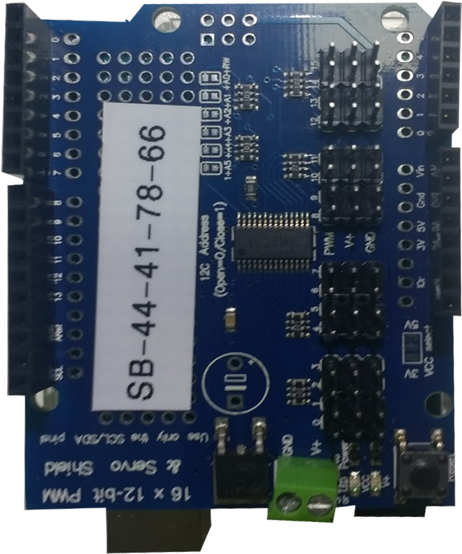

## Boards

Besides the Raspberry Pi, there are 3 main controller boards on your robot:

| [Motor Board](./motor-board.md) | [Power Board](./power-board.md) | [Servo Assembly](./servo-assembly/index.md) | [Raspberry Pi](./pi.md) |
|---|---|---|---|
|  |  |  |  |
