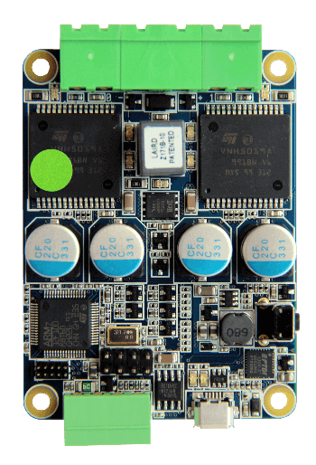
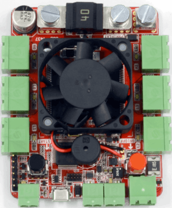
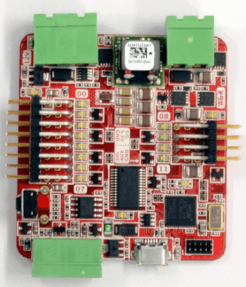
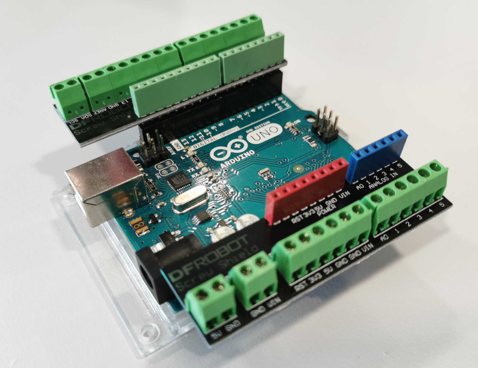
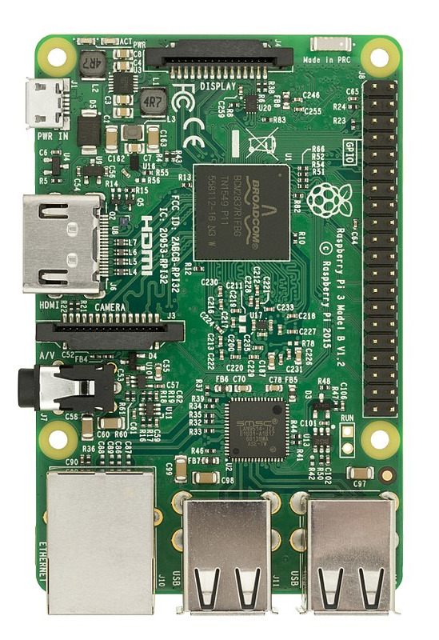

## Boards

Your kit consists of 5 main "boards":

| [Motor Board](./motor-board.md) | [Power Board](./power-board.md) | [Servo Board](./servo-board.md) | [Arduino](./arduino.md) | [Raspberry Pi](./pi.md) |
|---|---|---|---|---|
|  |  |  |  |  |
