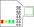

# Raspberry Pi

!!! danger
    Do not re-flash or edit the SD card. This will stop your robot working!

{ width="50%" }

The brain of your robot is a Raspberry Pi 3 / 3B+. This handles the running of your python code, recognition of markers and sends control commands to the other boards.

## Power Hat

Your Raspberry Pi has a Pi Power Hat mounted on the top. This allows you to connect power to it using a 3.81mm CamCon.

{ width="200" }

### Indicator LEDs

There are 4 indicator LEDs on the Pi Power Hat.

All LEDs will turn on at boot. After the Pi detects a USB stick, the LEDs work as follows:

1. This LED will illuminate bright green when your Raspberry Pi is on. You may also notice it flicker during boot.
2. This LED will illuminate green when your code has finished without error.
3. This LED will illuminate yellow whilst your code is running.
4. This LED will illuminate red if your code has crashed.

!!! tip
    The LEDs may take a few seconds to update after you insert or remove your USB.

## Technical Details

Your robot is running a customised version of the [Raspberry Pi OS](https://www.raspberrypi.com/software/) operating system.

When a USB stick is inserted, the SourceBots software will look for a file named `main.py`, and then execute it.

The output of your code is written to a file named `log.txt` on the USB stick.
