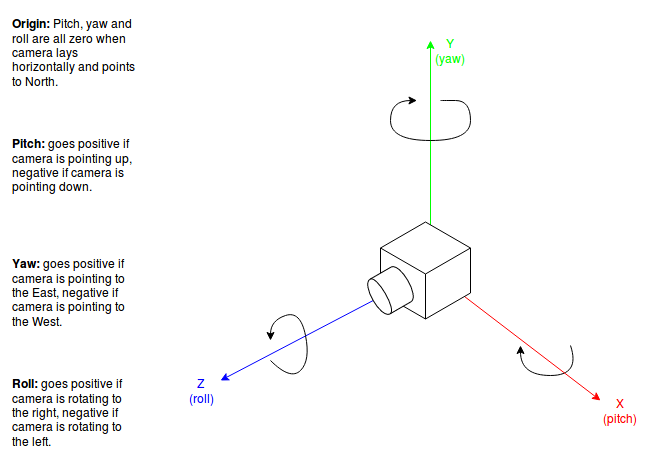

# Orientation



Orientation represents the rotation of a marker around the x, y, and z axes. These can be accessed as follows:

* `rot_x` / `pitch` - the angle of rotation in radians counter-clockwise about the Cartesian x axis.
* `rot_y` / `yaw` - the angle of rotation in radians counter-clockwise about the Cartesian y axis.
* `rot_z` / `roll` - the angle of rotation in radians counter-clockwise about the Cartesian z axis.

Rotations are applied in order of z, y, x.

```python
markers = r.camera.see()

for m in markers:
   print(m.orientation.rot_x)  # Angle of rotation about x axis.
   print(m.orientation.rot_y)  # Angle of rotation about y axis.
   print(m.orientation.rot_z)  # Angle of rotation about z axis.
```

!!! note
    In our use case the z axis always faces the camera, and thus will appear as a clockwise rotation

## Examples

The following table visually explains what positive and negative rotations represent.

!!! example
    0 in all axes:

    ![m0x0y0z]{ width="35%" }

|  | π/4 | -π/4 |
|---:|:---:|:---:|
| **`rot_x`** | ![m45x0y0z] | ![m-45x0y0z] |
| **`rot_y`** | ![m0x45y0z] | ![m0x-45y0z] |
| **`rot_z`** | ![m0x0y45z] | ![m0x0y-45z] |

[m0x0y0z]: ../../assets/img/api/vision/m0x0y0z.png
[m-45x0y0z]: ../../assets/img/api/vision/m-45x0y0z.png
[m0x-45y0z]: ../../assets/img/api/vision/m0x-45y0z.png
[m0x0y-45z]: ../../assets/img/api/vision/m0x0y-45z.png
[m0x0y0z]: ../../assets/img/api/vision/m0x0y0z.png
[m0x0y45z]: ../../assets/img/api/vision/m0x0y45z.png
[m0x45y0z]: ../../assets/img/api/vision/m0x45y0z.png
[m45x0y0z]: ../../assets/img/api/vision/m45x0y0z.png
