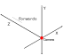
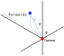

# Position

Your robot supports two different coordinates systems for position:

* Cartesian
* Spherical

The latter is a [Polar Coordinates system](https://en.wikipedia.org/wiki/Polar_coordinate_system).

## Cartesian

{ width="40%" }

The [cartesian coordinates system](https://en.wikipedia.org/wiki/Cartesian_coordinate_system) has three
_principal axes_ that are perpendicular to each other.

The value of each coordinate indicates the distance travelled along the axis to the point.

The camera is located at the origin, where the coordinates are ``(0, 0, 0)``.

```python
markers = robot.camera.see()

for m in markers:
    print(m.cartesian.x)  # Displacement from the origin in millimetres, along x axis.
    print(m.cartesian.y)  # Displacement from the origin in millimetres, along y axis.
    print(m.cartesian.z)  # Displacement from the origin in millimetres, along z axis.
```

!!! tip
    The `y` axis decreases as you go up. This matches convention for computer vision systems.

## Spherical

{ width="40%" }

The [spherical coordinates system](https://en.wikipedia.org/wiki/Spherical_coordinate_system) has
three values to specify a specific point in space.

* `distance` - The _radial distance_, the distance from the origin to the point, in millimetres.
* `rot_x` -  Rotation around the X-axis, in radians, corresponding to "theta" on the diagram.
* `rot_y` -  Rotation around the Y-axis, in radians, corresponding to "phi" on the diagram.

The camera is located at the origin, where the coordinates are `(0, 0, 0)`.

```python
markers = robot.camera.see()

for m in markers:
  print(m.spherical.distance)  # Distance from the origin in millimetres
  print(m.spherical.rot_x)  # The angle from the azimuth to the point, in radians.
  print(m.spherical.rot_y)  # The polar angle from the plane of the camera to the point, in radians.
```

!!! tip
    You can use the [`math.degrees`](https://docs.python.org/3/library/math.html#math.degrees) function to convert from radians to degrees.
